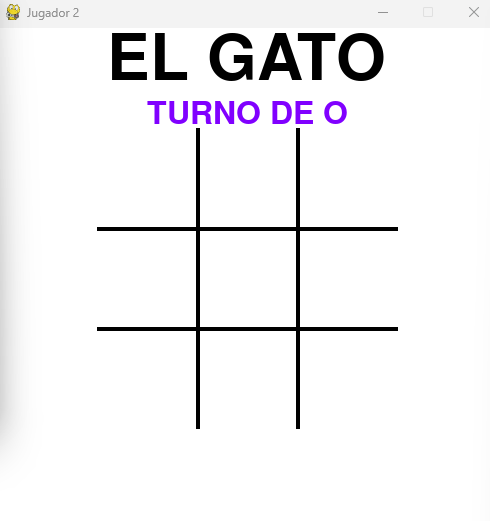
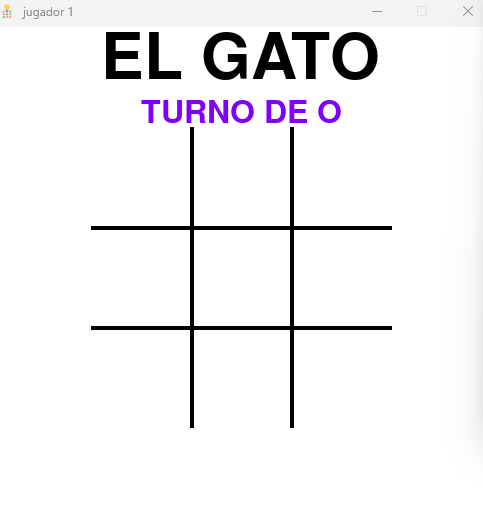

# Tic-Tac-Toe
- Tic Tac Toe juego con sockets y programado en pygame.
- Los jugadores pueden competir entre sí a través de una red conectándose al servidor.
  
## Requisitos previos
Para poder ejecutar este proyecto, necesitas tener instalado lo siguiente:
- Asegúrate de tener Python3.x.x instalado en tu sistema
  
Para instalar Python en Windows es sencillo solo debes de descargarlo en la página oficial de
Python al momento de instalarlo, marcamos la casilla donde dice Add python.exe to PATH

 | 

En caso de Linux, utilizamos la distribución de Ubuntu, entonces para la instalación de Python
usamos el comando:

```ps
sudo apt install python3 python3-pip
```
Si usas Windows estas librerías las puedes instalar en la terminal de VS CODE o en caso de tener
alguna distribución de Linux, usas la terminal del sistema, en dado caso de no tenerlas instaladas Para ello, ocupamos lo siguiente.
- Instalar las siguientes librerias usando pip:
```ps
a. pygame
b. socket
c. threading
d. pickle
e. tkinter
```
- se instalan de la siguiente forma:

```ps
pip install 'libreria'
```
Ejemplo:
```ps
pip install pygame
```

---
## Reglas del juego
- Objetivo: Ser el primero en alinear tres de tus símbolos (X o O) horizontalmente, verticalmente o  diagonalmente.
- Turnos: El juego alterna turnos entre dos jugadores: uno juega con X y el otro con O.
- Movimiento: Los jugadores colocan su símbolo en una celda vacía del tablero 3x3 durante su turno.
- Ganador: El primer jugador en alinear tres símbolos gana. Si todas las celdas están ocupadas sin un ganador, el juego termina en empate.
- Chat: Los jugadores pueden comunicarse entre sí a través de un chat en tiempo real mientras juegan.


---
## How to Play?
- Clone the Repository
```
git clone https://github.com/DhilipSanjay/Tic-Tac-Toe.git
```
- Move to the Directory `04 TicTacToe - Socket + Pygame`
```
cd "Tic-Tac-Toe\04 TicTacToe - Socket + Pygame"
```
- Start the Server
```
python server.py
```
- Start two players and enter the IP address. If both the players are on same host, use the loopback IP `127.0.0.1` or `localhost`.
    - Player 1
    ```
    python player.py
    pygame 1.9.6
    Hello from the pygame community. https://www.pygame.org/contribute.html
    Enter the server IP:localhost
    Connected to : localhost : 9999
    ```

    - Player 2
    ```
    python player.py
    pygame 1.9.6
    Hello from the pygame community. https://www.pygame.org/contribute.html
    Enter the server IP:127.0.0.1
    Connected to : 127.0.0.1 : 9999
    ```
- Now you can start playing Tic Tac Toe over a network.

---

## Screenshots
Player 1         |  Player 2
:-------------------------:|:-------------------------:
 | 

### Player 1 Wins


### Player 2 Wins


### Draw Game


---

### Note
Feel free to play the other versions of Tic Tac Toe in this repo *(on Terminal, on Terminal with Socket)*.

---
