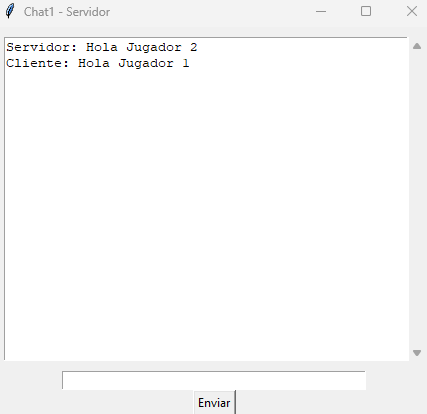
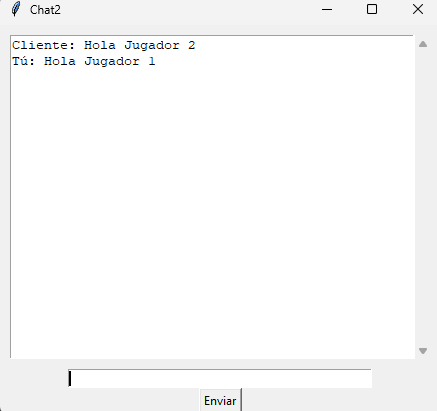

# Tic-Tac-Toe
- Tic Tac Toe juego con sockets y programado en pygame.
- Los jugadores pueden competir entre sí a través de una red conectándose al servidor.
  
## Requisitos previos
Para poder ejecutar este proyecto, necesitas tener instalado lo siguiente:
- Asegúrate de tener Python3.x.x instalado en tu sistema
  
Para instalar Python en Windows es sencillo solo debes de descargarlo en la página oficial de
Python al momento de instalarlo, marcamos la casilla donde dice Add python.exe to PATH

 

En caso de Linux, utilizamos la distribución de Ubuntu, entonces para la instalación de Python
usamos el comando:

```ps
sudo apt install python3 python3-pip
```
Si usas Windows estas librerías las puedes instalar en la terminal de VS CODE o en caso de tener
alguna distribución de Linux, usas la terminal del sistema, en dado caso de no tenerlas instaladas Para ello, ocupamos lo siguiente.
- Instalar las siguientes librerias usando pip:
```ps
a. pygame
b. socket
c. threading
d. pickle
e. tkinter
```
- se instalan de la siguiente forma:

```ps
pip install 'libreria'
```
Ejemplo:
```ps
pip install pygame
```

---
## Reglas del juego
- Objetivo: Ser el primero en alinear tres de tus símbolos (X o O) horizontalmente, verticalmente o  diagonalmente.
- Turnos: El juego alterna turnos entre dos jugadores: uno juega con X y el otro con O.
- Movimiento: Los jugadores colocan su símbolo en una celda vacía del tablero 3x3 durante su turno.
- Ganador: El primer jugador en alinear tres símbolos gana. Si todas las celdas están ocupadas sin un ganador, el juego termina en empate.
- Chat: Los jugadores pueden comunicarse entre sí a través de un chat en tiempo real mientras juegan.


---
## Como jugar?
Puedes hacerlo ejecutando el archivo llamado menu.py, para iniciar usando el comando Python menú.py o ejecutándolo
directamente usando un IDE, esto para ambos jugadores, para crear una partida, un jugador debe
de crear la sala y el otro debe unirse a dicha sala.
- O en caso de que estes en linux, puedes descargarlo desde la terminal. Para eso ocupas git

## Como se instala git?
Para instalar Git en Ubuntu, puedes seguir estos pasos:

- Instala git
```
sudo apt install git
```
- Verificar la instalación:
```
git --version
```
Configurar Git:
```
git config --global user.name "Tu Nombre"
git config --global user.email "tuemail@example.com"
```
Una vez teniendo instalado git, seguimos las siguientes instrucciones para poder jugar Tic Tac Toe
- Clona el repositorio
```
git clone https://github.com/DhilipSanjay/Tic-Tac-Toe.git
```
- Entra a la carpeta del juego `Juego-Online`
```
cd "Juego-Online"
```
- Inicia el juego
```
python menu.py
```

---

## Screenshots
Player 1         |  Player 2
:-------------------------:|:-------------------------:
 | 

### Player 1 chat


### Player 2 chat


---

